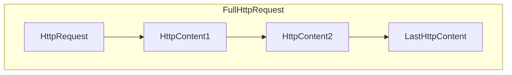
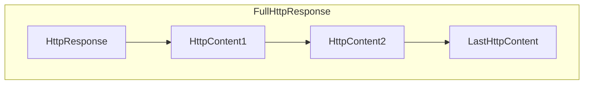

### 代码导读
### Bootstrap 启动类
> - 饿汉式单例`ConfigLoader`初始化核心配置 `config`，配置支持动态配置，可以从**配置文件**，**环境变量**，**jvm参数**，**运行参数**初始化；
> - `ConfigCenter`为==配置中心==接口，根据配置文件加载配置中心；注册中心使用到了 **java SPI** 机制，从 META-INF/services 加载其接口实现类，目前实现有`Naocs`和`Zookeeper` ；随后`init()`和`subscribeRulesChagne()`使用了各配置中心的SDK或第三方客户端来创建配置和订阅配置；当配置变更时会监听触发回调更新并写回配置；
> - `Container` 容器，定义了 netty 相关的服务；
> - `RegisterCenter`注册中心接口，和配置中心类似，提供了`init()`初始化操作,`register()`注册服务,`deregister()`注销服务，`subscribeAllServicesChang()`订阅所有服务变更；定义规范，后续添加注册中心只需实现该接口即可；
> - `ServiceDefinition` `ServiceInstance` 封装了服务定义和服务实例的元数据。
> - Runtime.getRuntime().addShutdownHook()当jvm退出时，创建一个线程去删除注册中心的实例；

#### Container

> container 的构造器中调用了初始化方法 `init()`；该方法中创建了 NettyHttpServer 和 NettyHttpClient ;

#### registerAndSubscribe()

> 主要功能：
>
> 1. 根据配置选择对应的注册中心并初始化；
> 2. 根据配置构建服务定义`ServiceDefinition`和服务实例`ServiceInstance`，并进行服务注册；
> 3. `subsrcibeAllServiceChange` 订阅所有服务变更；当服务有变更时，例如上线，下线；会同步到`DynamicConfigManager`中；
> 4. `DynamicConfigManager`中定义了两个 ConcurrentHashMap 分别用来存访服务定义和服务实例的关系；

### Netty相关

消息流转几个重要的流程：

1. <font color=red>入站处理器 `NettyServerHttpInboundHandler` 中 channelRead 将对消息进行封装为HttpRequestWrapper，交由 `NettyProcessor`.process 处理;</font>

2. `RequestHelper`.doContext 主要是构建网关核心上下文 gatewayContext，随后在`服务注册中心`根据消息的 **uniqueId** 获取对应的服务实例；

3. `filterFactory`.buildFilterChain 构建过滤器链（这里根据配置中心的配置构建了过滤器链，比如负载均衡，路由过滤器等以及用户自定义的过滤器链，只要加了`FilterAspect`注解的都可以，利用了Java SPI 机制扫描了所有的Filter）； **executeFilter** 中遍历各个 `Filter`，执行 filter 的逻辑；以轮询过滤器举例，从 gatewayContext 中获取服务名，将 gatewayContext 中的请求中的 ip 和 port 替换为服务实例具体的 ip 和 port ；
4. 最后的过滤器会执行到`RouterFilter`;

#### HttpServerCodec

> Netty中专门用于处理 Http 协议的编码和解码器，包含了`HttpRequestDecoder`和`HttpResponseEncoder`两个组件，分别用于**解码客户端发送的 Http 请求 和编码服务端发送的 Http 响应；**

- HttpRequestDeocder 将字节解码为 HttpRequest、HttpContent 和 LastHttpContent 消息；
- HttpResponseEncoder 将 HttpResponse、HttpContent 和 LastHttpContent 消息编码为字节；

###### HTTP 请求的组成部分



- HttpRequest 请求的第一个响应，包含请求头部信息；
- HttpContent 包含数据，后面可能还跟着多个 HttpContent 部分；
- LastHttpContent 标记了该 Http请求的结束，可能还包含了尾随的 Http 头部信息；

###### Http 响应的组成部分



- HttpResponse 相应的第一个部分，包含了 Http 的头部信息；
- HttpContent 包含数据，后面可能还跟着多个 HttpContent 部分；
- LastHttpContent 标记了该 Http 响应的结束，可能还包含了尾随的 Http 头部信息；

> 总结：一个 Http 请求/响应可能由多个数据部分组成，并且它总是以一个 LastHttpContent 部分作为结束。FullHttpRequest 和 FullHttpResponse 分别代表了完整的请求和消息。

#### HttpObjectAggregator 聚合消息

> 在处理 HTTP 请求和响应时，数据通常以多个部分（例如 HTTP 头部、消息体等）的形式传输，而 `HttpObjectAggregator` 的作用就是将这些部分聚合成一个完整的 `FullHttpRequest` 或 `FullHttpResponse` 对象。
>
> 当客户端或服务端发送的 HTTP 消息体较大时，可能会被切分成多个 `HttpContent` 对象。`HttpObjectAggregator` 负责将这些部分**聚合成一个完整的 `FullHttpRequest` 或 `FullHttpResponse` 对象。**

#### NettyServerHttpInboundHandler

> 消息入站处理器，将消息交给 `NettyProcessor` 处理；

### 核心接口

#### LifeCycle

> 定义核心功能服务的初始化，启动，关闭状态规范；核心服务实现该接口，做一些初始化配置，优雅关闭等；
>
> 实现类：
>
> Container
>
> NettyHttpClient
>
> NettyHttpServer

### 核心类

#### NettyHttpClient

> 项目中 处理Http请求 使用到了`AsyncHttpClient`框架，在 init()方法中初始化了 **asyncHttpClient**；
>
> 同类 Http 请求框架有 OkHttp、HttpClient等；
>
> - AsyncHttpClient:AsyncHttpClient 主要面向异步的 HTTP 请求，适合高并发、非阻塞的应用场景。高性能的轻量级框架。适合高并发、非阻塞的异步应用和对性能和轻量级要求较高的场景。
> - OkHttp:OkHttp 是一个高性能的 HTTP 客户端，被广泛使用于 Android 平台以及 Java 环境。清晰的 API，易于使用，并支持同步和异步请求。内置了连接池，可重用连接，减少连接的建立和关闭带来的开销。 OkHttp 提供拦截器机制，允许在请求和响应的处理过程中添加、修改或拦截操作，提高了灵活性。
> - HttpClient:Apache HttpClient 是 Apache 软件基金会的项目，经过长时间的发展和验证，稳定性较好。 相对于一些轻量级的库，Apache HttpClient 的包大小和性能开销可能较大。

#### NettyHttpSever

> 该类中就是初始化 netty server 端，pipeLine 添加自定义出站入站处理器 `NettyServerConnectManagerHandler`，入站处理器 `NettyServerHttpInboundHandler`，`HttpServerCodec`编解码器,`HttpObjectAggregator`聚合消息等；
>
> - `NettyServerHttpInboundHandler`中会将消息交给 `NettyProcessor`处理；
> - `RequestHelper`.doContext 构建网关上下文`gatewayContext`；
> - 过滤器工厂`FilterFactory`中的过滤器对 `gatewayContext`执行各个过滤器的逻辑，例如负载均衡等；
> - 最后是`RouterFilter`执行，交给`AsyncHttpHelper`.executeRequest。该方法是 AsyncHttpClient 提供的异步执行请求的方法；

#### AsyncHttpHelper

#### DynamicConfigManager

> 一个用来存放服务定义，服务实例，路径及规则的本地缓存，请求最后都会在该缓存将`服务ID`替换为真实服务地址+ip,减少每次请求都去注册中心拉取请求，造成注册中心的负载压力；注册中心和配置中心都有监听器接口，要求实现该监听器功能完成配置变化/服务变化时能更新`DynamicConfigManager`缓存，尽可能保证可用性；
>
> **属性介绍：**
>
> ```java
> //服务的定义集合：uniqueId代表服务的唯一标识
> private final ConcurrentHashMap<String /* uniqueId */ , ServiceDefinition> serviceDefinitionMap = new ConcurrentHashMap<>();
> 
> //服务的实例集合：uniqueId与一堆服务实例对应
> private final ConcurrentHashMap<String /* uniqueId */ , Set<ServiceInstance>> serviceInstanceMap = new ConcurrentHashMap<>();
> 
> //规则集合
> private ConcurrentHashMap<String /* ruleId */ , Rule> ruleMap = new ConcurrentHashMap<>();
> 
> //路径以及规则集合
> private ConcurrentHashMap<String/*路径 */, Rule> pathRuleMap = new ConcurrentHashMap<>();
> private ConcurrentHashMap<String/*服务名*/, List<Rule>> serviceRuleMap = new ConcurrentHashMap<>();
> ```

#### RequestHelper

http://192.168.126.3:8083/http-server/ping	GET	headers:	uniqueId:backend-http-server:1.0.0	Cache-Control:no-cache	Postman-Token:e478e021-cd56-49e9-88c1-eeff6117469f	content-length:0

#### 

