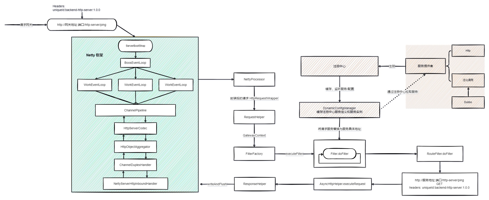

### 网关设计

### 网关模块介绍

| 模块                                                         | 介绍                                                         |
| ------------------------------------------------------------ | ------------------------------------------------------------ |
| [backend-dubbo-server](https://github.com/guohaichen/api-gateway/tree/main/backend-dubbo-server) | 后端 dubbo 服务提供者，http 访问，api-gateway 泛化调用 dubbo 服务返回响应；*待完善更新，泛化调用中的参数未解析* |
| [backend-http-server](https://github.com/guohaichen/api-gateway/tree/main/backend-http-server) | 后端 http 服务提供者；                                       |
| [gateway-client](https://github.com/guohaichen/api-gateway/tree/main/gateway-client) | 服务提供者引入该包，定义了核心注解，扫描服务提供端[http,dubbo]的方法并**注册**到注册中心和配置中心； |
| [gateway-common](https://github.com/guohaichen/api-gateway/tree/main/gateway-common) | 公共包，定义配置**规则 Rule**，**服务定义 ServiceDefinition**，**服务实例 ServiceInstance**，常量，响应状态码，异常状态码，工具类等； |
| [gateway-config-center](https://github.com/guohaichen/api-gateway/tree/main/gateway-config-center) | 配置中心实现，支持 nacos, zookeeper;                         |
| [gateway-core](https://github.com/guohaichen/api-gateway/tree/main/gateway-core) | 核心包，构建 netty 服务，过滤器工厂对消息流转负载均衡下发，限流，验证，路由等； |
| [gateway-register-center](https://github.com/guohaichen/api-gateway/tree/main/gateway-register-center) | 注册中心，支持 nacos, zookeeper;                             |

