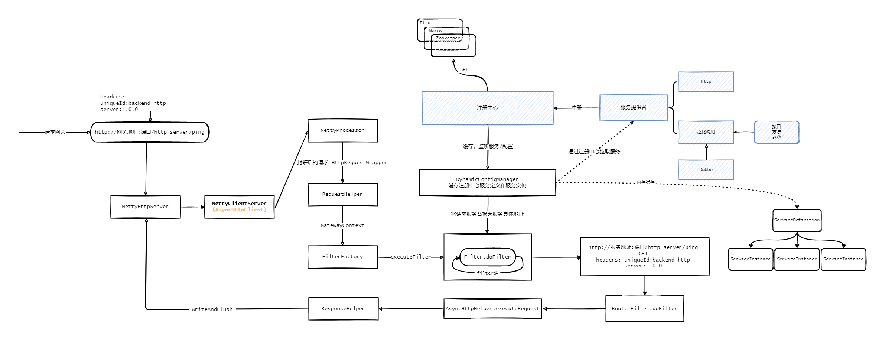
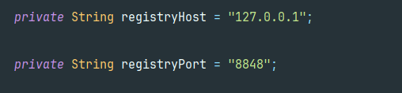
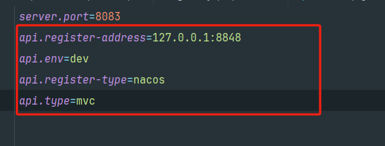

### 网关设计



### 网关模块介绍

| 模块                                                         | 介绍                                                         |
| ------------------------------------------------------------ | ------------------------------------------------------------ |
| [backend-dubbo-server](https://github.com/guohaichen/api-gateway/tree/main/backend-dubbo-server) | demo用，后端 dubbo 服务提供者，http 访问，api-gateway 泛化调用 dubbo 服务返回响应；*待完善更新，泛化调用中的参数未解析*； |
| [backend-http-server](https://github.com/guohaichen/api-gateway/tree/main/backend-http-server) | demo用，后端 http 服务提供者；                               |
| [gateway-client](https://github.com/guohaichen/api-gateway/tree/main/gateway-client) | 服务提供者引入该包，定义了核心注解，扫描服务提供端[http,dubbo]的方法并**注册**到注册中心和配置中心； |
| [gateway-common](https://github.com/guohaichen/api-gateway/tree/main/gateway-common) | 公共包，定义配置**规则 Rule**，**服务定义 ServiceDefinition**，**服务实例 ServiceInstance**，常量，响应状态码，异常状态码，工具类等； |
| [gateway-config-center](https://github.com/guohaichen/api-gateway/tree/main/gateway-config-center) | 配置中心实现，支持 nacos, zookeeper，etcd;                   |
| [gateway-core](https://github.com/guohaichen/api-gateway/tree/main/gateway-core) | 核心包，构建 **netty http** 服务。netty 作为外部请求的连接，使用`AsyncHttpClient`流转内部服务经过一系列`Filter`并响应； |
| [gateway-register-center](https://github.com/guohaichen/api-gateway/tree/main/gateway-register-center) | 注册中心，支持 nacos, zookeeper，etcd;                       |

### 快速开始

> 前提：
>
> 1. 本地已开启注册中心服务（以**nacos为例**），并将注册中心地址和端口号写到 `gateway-core`包下的`Config`类中，例如：
>
>     
>
> 
>
> 2. 后端服务提供者也需要配置中心中心服务的地址和端口，写在springboot配置文件中，以及接口类型（**api.type**），比如是 http/dubbo 服务 对应的值为 `mvc`/`dubbo`接口 例如：
>
>     
>
> 3. 在配置中心编写网关配置文件，主要是定义协议，路由规则，限流，负载均衡;*这里使用的格式是json*；名称为`api-gateway`；名称定义在`gatway-core`包下`Config`中；
>
> ```json
> {
>   "rules": [
>     {
>       "id": "001",
>       "name": "1号规则",
>       "protocol": "http",
>       "serviceId": "backend-http-server",
>       "prefix": "/http-server",
>       "paths": [
>         "/http-server/ping",
>         "/http-server/test",
>         "/http-server/post"
>       ],
>       "filterConfigs": [
>         {
>           "id": "load_balance_filter",
>           "config": {
>             "load_balance": "RoundRobin"
>           }
>         },
>         {
>           "id": "flow_ctl_filter"
>         }
>       ],
>       "flowCtlConfigs": [
>         {
>           "type": "path",
>           "model": "distributed_flowCtl",
>           "value": "/http-server/ping",
>           "config": {
>             "duration": 20,
>             "permits": 2
>           }
>         }
>       ]
>     },
>     {
>       "id": "dubbo.100",
>       "name": "dubbo规则",
>       "protocol": "dubbo",
>       "serviceId": "backend-dubbo-server",
>       "prefix": "/dubbo",
>       "paths": [
>         "/dubbo-server/ping",
>         "/dubbo-server/list",
>         "/dubbo-server/user"
>       ],
>       "filterConfigs": [
>         {
>           "id": "dubbo_filter"
>         },
>         {
>           "id": "load_balance_filter",
>           "config": {
>             "load_balance": "RoundRobin"
>           }
>         }
>       ]
>     }
>   ]
> }
> ```
>
> 4. 启动网关服务 `Bootstrap`，以及各个服务提供者 如 `backend-dubbo-server`,`backend-http-server`；
> 5. 测试：`backend-http-server`有一个mvc接口为 "/http-server/ping",为 GET 方法；使用 postman 测试，访问 网关 http://localhost:8088/http-server/ping 并添加`Headers`： uniqueId:backend-http-server:1.0.0 即可通过网关转发到具体的服务提供者并正确返回；

